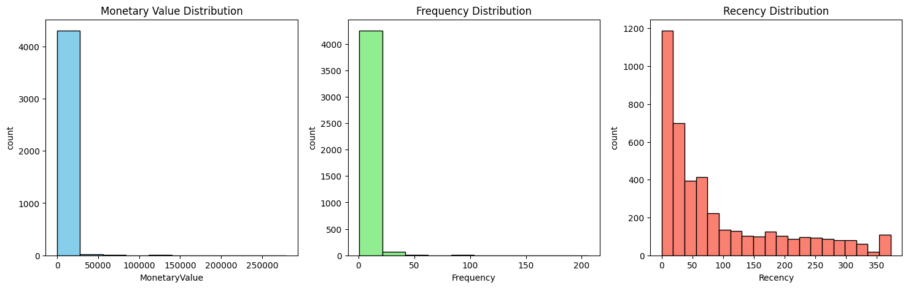

# 🧠 Online Retail Customer Behaviour Using K-Means Clustering

__Can Data-Driven Customer Segmentation Drive Revenue Growth?__
<br/> In today’s competitive e-commerce landscape, understanding your customers is no longer optional — it’s mission-critical. Inspired by my passion for turning data into strategy, I embarked on this project to explore how unsupervised learning can segment customers based on behavioral traits and purchasing patterns.

Through robust data analysis and K-Means clustering, I aimed to answer critical questions:
- Can customer behavior be grouped meaningfully using machine learning?
- How do we identify high-value, loyal customers vs. one-time buyers?
- What segmentation strategy leads to better targeting and retention?


---

## 📌 1. Project Objective
This project focuses on analyzing online retail customer data using RFM (Recency, Frequency, Monetary) metrics to build actionable customer segments with K-Means clustering. The goal is to enhance customer targeting, optimize marketing campaigns, and increase customer lifetime value (CLV).

## 🧰 Tools & Technologies
- Python, Pandas, NumPy
- Scikit-learn (KMeans, StandardScaler)
- Matplotlib, Seaborn
- Jupyter Notebook

---

## 🛠️ Actions
**✅ Data Collection and Preparation**
- Cleaned 500K+ transaction records (handled nulls, returns, duplicates)
- Filtered to valid customer purchases and computed Total Revenue per transaction

**✅ Feature Engineering (RFM Analysis)**
- **Recency:** Days since last purchase
- **Frequency:** Total number of transactions
- **Monetary:** Total amount spent

**✅ Data Transformation**
<br/> Scaled RFM values using StandardScaler for optimal clustering performance

**✅ Clustering & Optimization**
- Used **Elbow Method** and **Silhouette Score** to determine the optimal number of clusters (K = 4)
- Applied **K-Means Clustering** to segment customers
- Visualized clusters with Seaborn and Matplotlib

   

**K-Means Clustering**
   - Clustered customers into 4 segments.
   - Interpreted and visualized the results.

   

## 📊 2.Data Overview
To power this customer segmentation project, I worked with a real-world e-commerce transactions dataset containing detailed purchase records from an online UK-based retail store between December 2010 and December 2011. The dataset provided a rich foundation for uncovering customer behavior patterns and segmenting users based on purchasing habits.

### Data Description:
📌 541,909 transactions across 37 countries
- **Key Attributes**
   - InvoiceNo — Transaction identifier
   - StockCode — Product code
   - Description — Product description
   - Quantity — Number of units purchased
   - InvoiceDate — Date and time of transaction
   - UnitPrice — Price per unit in GBP
   - CustomerID — Unique customer identifier
   - Country — Customer location
---
### Preprocessing Steps:
- Handled missing values
- Standardized 
## 📊 3. Code & Visuals
- RFM heatmaps and cluster scatter plots
- Customer distribution across segments
- Visual summaries of cluster behavior
📌 (included in GitHub and portfolio visuals)

## 🧠 Key Insights
- High-value customers identified and profiled.
- Provided a roadmap for:
  - Loyalty programs
  - Targeted marketing
  - Churn reduction

---
## 📈 4. Results Summary
| Cluster | Description                | Profile Summary                          | Actionable Insight
|---------|----------------------------|------------------------------------------|-------------------------------------
| 0       | High-Value Loyal Customers | Frequent, recent, high spenders          | Implement a robust loyalty program, provide exclusive offers, and recognize their loyalty to keep them engaged and satisfied.
| 1       | At-Risk Customers          | Infrequent, long gaps, low spending      | Reactivate with re-engagement campaign, special discounts, or reminders to encourage them to return and purchase again.
| 2       | Occasional Buyers          | Moderate frequency, average spend        | Focus on building relationships, providing excellent customer service, and offering incentives to encourage more frequent purchases.
| 3       | One-Time Low Spenders      | Rare and low spend                       | Use targeted marketing campaigns, special discounts, or reminders to encourage them to return and purchase again.

## 📈 Business Impact
- Personalized customer journeys
- Optimized customer lifetime value (CLV)
- Stronger marketing ROI

---

## 💡 5. Executive Summary
**Objective Recap:**
<br/> This project leverages unsupervised machine learning (K-Means clustering) to segment customers based on purchasing behavior using RFM analysis. The goal is to provide actionable customer insights to support data-driven marketing, retention, and revenue growth strategies.

**Key Findings:**
- Identified four customer segments with distinct behavioral profiles.
- High-value loyal customers (Cluster 0) drove the majority of revenue despite being a smaller group.
- One-time and low-value buyers represented the largest share by volume but contributed the least to revenue.
- Clustering enabled targeted marketing recommendations for each group, maximizing campaign ROI.

**Challenges & Learnings:**
- Some clusters showed overlapping traits, suggesting potential for further refinement with advanced clustering methods (e.g., DBSCAN, GMM).
- Time-based trends (e.g., seasonal shopping) were not yet integrated — future work could incorporate temporal features to improve segmentation accuracy.
- Scaling and deployment considerations emerged, such as real-time updates and CRM integration.

## 🔹 6. Discussion, Growth, and Next Steps
**Future Enhancements:**
- Integrate supervised learning to predict customer lifetime value (CLV) and churn risk across segments.
- Incorporate time-series features (e.g., recency decay, seasonality trends) for dynamic clustering.
- Experiment with alternative clustering algorithms like DBSCAN, Hierarchical, or GMM for finer segmentation.

**Deployment Considerations:**
- Develop a Streamlit or Power BI dashboard for real-time monitoring of customer clusters.
- Automate the data pipeline for daily updates and integration with CRM tools (e.g., HubSpot, Salesforce).
- Set up alerts and triggers for when high-value customers shift behavior patterns.

**Expanding the Scope:**
- Apply segmentation insights to personalize marketing campaigns, retention strategies, and email automation.
- Explore segment-based pricing, loyalty programs, and personalized offers.
- Use A/B testing to validate the impact of personalized strategies on each customer cluster.

## 🚀 How to Run
```bash
1. Clone this repo
2. Open the notebook: Online Retail Customer Behaviour Using K-Means Clustering II.ipynb
3. Run all cells
```

---

## 📂 Files
- `Online Retail Customer Behaviour Using K-Means Clustering II.ipynb`
- `kmeans_plot_1.png` – Elbow Method
- `kmeans_plot_2.png` – Cluster Visualization
- `kmeans_plot_3.png` – Heatmap
- `kmeans_plot_4.png` – Distribution Plot

---

## 📬 Connect with Me
[LinkedIn](https://www.linkedin.com/in/YOUR_PROFILE) · [Portfolio](https://YOUR_PORTFOLIO_LINK)
