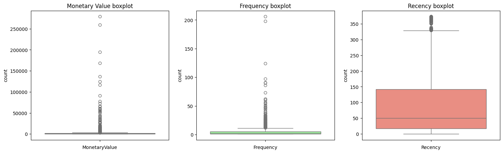

# 🧠 Online Retail Customer Behaviour Using K-Means Clustering

__Can Data-Driven Customer Segmentation Drive Revenue Growth?__
<br/> In today’s competitive e-commerce landscape, understanding your customers is no longer optional — it’s mission-critical. Inspired by my passion for turning data into strategy, I embarked on this project to explore how unsupervised learning can segment customers based on behavioral traits and purchasing patterns.

Through robust data analysis and K-Means clustering, I aimed to answer critical questions:

- Can customer behavior be grouped meaningfully using machine learning?

- How do we identify high-value, loyal customers vs. one-time buyers?

- What segmentation strategy leads to better targeting and retention?


---

## 📌 Project Objective
To cluster customers based on their purchasing behavior using RFM (Recency, Frequency, Monetary) analysis and K-Means clustering, enabling better targeting and business strategy.

---

## 🧰 Tools & Technologies
- Python, Pandas, NumPy
- Scikit-learn (KMeans, StandardScaler)
- Matplotlib, Seaborn
- Jupyter Notebook

---

## 📊 Methodology

1. **Data Preprocessing**
   - Removed nulls, duplicates, and returns.
   - Filtered transactions with valid CustomerID.

2. **RFM Feature Engineering**
   - Recency: Days since last purchase.
   - Frequency: Number of purchases.
   - Monetary: Total amount spent.

3. **Data Scaling**
   - Standardized RFM features for clustering.

4. **Optimal K Selection**
   - Elbow Method & Silhouette Score:

   

5. **K-Means Clustering**
   - Clustered customers into 4 segments.
   - Interpreted and visualized the results.

   

---

## 🧠 Key Insights
- High-value customers identified and profiled.
- Provided a roadmap for:
  - Loyalty programs
  - Targeted marketing
  - Churn reduction

---

## 📈 Business Impact
- Personalized customer journeys
- Optimized customer lifetime value (CLV)
- Stronger marketing ROI

---

## 🚀 How to Run
```bash
1. Clone this repo
2. Open the notebook: Online Retail Customer Behaviour Using K-Means Clustering II.ipynb
3. Run all cells
```

---

## 📂 Files
- `Online Retail Customer Behaviour Using K-Means Clustering II.ipynb`
- `kmeans_plot_1.png` – Elbow Method
- `kmeans_plot_2.png` – Cluster Visualization
- `kmeans_plot_3.png` – Heatmap
- `kmeans_plot_4.png` – Distribution Plot

---

## 📬 Connect with Me
[LinkedIn](https://www.linkedin.com/in/YOUR_PROFILE) · [Portfolio](https://YOUR_PORTFOLIO_LINK)
